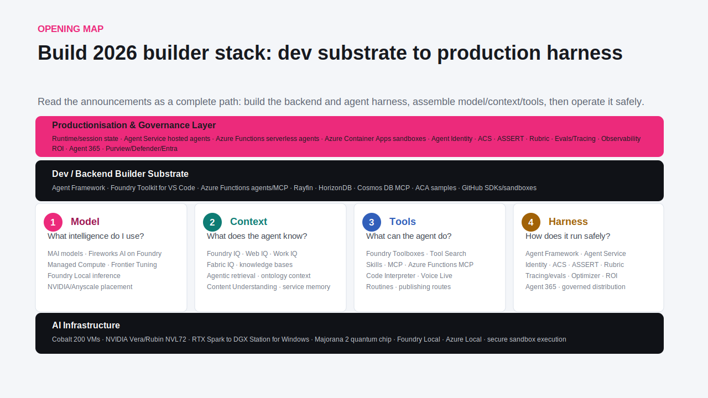

# Microsoft Build 2026 AI Builder Atlas

Public-safe repo for mapping Microsoft Build 2026 AI announcements into builder-ready samples, demos, and implementation tracks.

The target persona is the AI builder: someone who wants to assemble models, context, tools, runtime, identity, evaluations, and deployment into production-grade agent systems.

Last refreshed: 2026-06-05.

Static page: [index.html](index.html)

## Opening Map

The repo is organized around the practical builder path:

1. Model: choose and adapt the model layer.
2. Context: ground agents with enterprise, operational, and web knowledge.
3. Tools: expose safe actions through MCP, toolboxes, code execution, and app connectors.
4. Harness: run agents with identity, state, memory, evals, observability, and governance.
5. Infrastructure: place the workload on local, serverless, container, and AI compute substrates.

See [docs/ai-builder-map.md](docs/ai-builder-map.md) for the full structure.

## AI Update Classification

Read the Build 2026 AI announcements as a complete builder path: build the backend and agent harness, assemble model/context/tools, then operate it safely.

| Layer | Role in the builder stack | Representative updates |
| --- | --- | --- |
| Productionisation & Governance | Controls agents before they touch real users, enterprise data, or business workflows. | Runtime/session state, Agent Service hosted agents, Azure Functions serverless agents, Azure Container Apps sandboxes, Agent Identity, ACS, ASSERT, Rubric, evals/tracing, observability, ROI, Agent 365, Purview/Defender/Entra, Windows agent containment, Discovery evidence loops. |
| Dev / Backend Builder Substrate | Gives builders the frameworks, SDKs, MCP surfaces, and local loops needed to turn announcements into samples. | Agent Framework, Foundry Toolkit for VS Code, Azure Functions agents/MCP, Rayfin, HorizonDB, Cosmos DB MCP, ACA samples, GitHub SDKs/sandboxes, GitHub Copilot app, Rayfin CLI, Windows AI dev loop. |
| 1. Model | Chooses the intelligence layer. | MAI models, Fireworks AI on Foundry, Managed Compute, Frontier Tuning, Foundry Local inference, Foundry Local on Azure Local, model routing, NVIDIA/Anyscale placement. |
| 2. Context | Decides what the agent knows. | Foundry IQ, Web IQ, Microsoft IQ, Scout, Work IQ, Fabric IQ, HorizonDB operational data, knowledge bases, agentic retrieval, graph/ontology/semantic context, Content Understanding, service memory. |
| 3. Tools | Defines what the agent can do. | Foundry Toolboxes, Tool Search, skills, MCP, Azure Functions MCP, Code Interpreter, Voice Live, routines, publishing routes, Rayfin backend generation, Copilot worktree orchestration. |
| 4. Harness | Runs the agent safely in production. | Agent Framework, Agent Service, Identity, ACS, ASSERT, Rubric, tracing/evals, Optimizer, ROI, Agent 365, governed distribution, Windows MXC policy, Windows 365 Agents. |
| AI Infrastructure | Provides the compute and execution substrate. | Cobalt 200 VMs, NVIDIA Vera/Rubin NVL72, RTX Spark to DGX Station for Windows, Majorana 2, Foundry Local, Azure Local, Managed Compute GPUs, Windows AI APIs, secure sandbox execution. |

## Repo Contents

- [docs/announcement-index.md](docs/announcement-index.md): public announcement map with sample opportunities.
- [docs/build-2026-latest-content-scan.md](docs/build-2026-latest-content-scan.md): latest public Build 2026 content scan.
- [docs/ai-builder-map.md](docs/ai-builder-map.md): AI-builder capability structure.
- [docs/repo-operating-model.md](docs/repo-operating-model.md): how to keep public and private material separated.
- [samples/README.md](samples/README.md): sample backlog and maturity ladder.
- [demos/README.md](demos/README.md): demo narrative options.
- [scripts/validate-public-boundary.sh](scripts/validate-public-boundary.sh): pre-push check for private or binary artifacts.

## First Sample Tracks

| Track | Builder question | Planned sample |
| --- | --- | --- |
| Agent Framework + Toolbox | How do I give an agent governed tools without custom plumbing? | Framework agent connected to a Foundry Toolbox/MCP endpoint. |
| Foundry IQ grounding | How do I ground an agent across enterprise and web context? | Retrieval-first agent with Foundry IQ and explicit source reporting. |
| Azure Functions serverless agent | How do I run an event-driven agent cheaply and durably? | Function-hosted markdown or code agent with MCP auth and durable workflow notes. |
| Container Apps sandbox | How do I let agents run code safely? | Dynamic session/code-interpreter sandbox with identity and network controls. |
| AgentOps eval loop | How do I know if the agent is safe and improving? | Traces, rubric evals, guardrail checks, and ROI/quality dashboard shape. |
| Model router + inference substrate | Which model and runtime should handle each task? | Task router across MAI, Fireworks, Managed Compute, Foundry Local, and GPU/VM paths. |
| Foundry Local edge agent | How do I run useful AI where data or latency keeps me local? | Local-first voice/retrieval agent with Azure Local deployment notes. |
| Prompt-to-production backend | How does an agent ship a real backend instead of loose code? | Rayfin + Fabric + HorizonDB backend blueprint with auth, data, and policy review. |
| Windows local-agent harness | How do I run desktop agents with OS containment and identity? | Windows AI / MXC / Aion harness checklist for local model execution and policy. |
| Copilot worktree workflow | How do I coordinate parallel agent sessions without losing review control? | GitHub Copilot app workflow for worktrees, PR gates, rollback, and traceability. |
| Discovery research agent | How do I make agentic research reviewable instead of speculative? | Microsoft Discovery-inspired hypothesis, evidence, tool-use, and review loop. |

## Public Source Baseline

This repo uses public Microsoft sources as the external source of truth, including:

- Microsoft Build 2026 newsroom: https://news.microsoft.com/build-2026/
- Microsoft Build 2026 official blog: https://blogs.microsoft.com/blog/2026/06/02/microsoft-build-2026-be-yourself-at-work/
- Microsoft Foundry Build recap: https://devblogs.microsoft.com/foundry/whats-new-in-microsoft-foundry-build-2026/
- Microsoft AI model family: https://microsoft.ai/news/building-a-hillclimbing-machine-launching-seven-new-mai-models/
- Foundry Managed Compute: https://devblogs.microsoft.com/foundry/announcing-foundry-managed-compute/
- Foundry Agent Service at Build: https://devblogs.microsoft.com/foundry/agent-service-build2026/
- Foundry agent distribution: https://devblogs.microsoft.com/foundry/agent-distribution-build2026/
- Foundry IQ Build updates: https://devblogs.microsoft.com/foundry/build-smarter-agents-faster-with-foundry-iq/
- Foundry Local Build update: https://devblogs.microsoft.com/foundry/accelerate-edge-ai-development-with-foundry-local/
- Trust, evals, ASSERT, and ACS: https://devblogs.microsoft.com/foundry/build-2026-open-trust-stack-ai-agents/
- Observability and ROI: https://devblogs.microsoft.com/foundry/build-2026-from-observability-to-roi-for-ai-agents-on-any-framework/
- Agent Optimizer: https://devblogs.microsoft.com/foundry/agent-optimizer-build2026/
- Fabric, Rayfin, HorizonDB, and databases: https://azure.microsoft.com/en-us/blog/microsoft-build-2026-building-agentic-apps-with-microsoft-fabric-and-microsoft-databases/
- Azure Cobalt 200: https://azure.microsoft.com/en-us/blog/new-azure-cobalt-200-vms-deliver-50-performance-improvement-fully-optimized-for-modern-agentic-ai-workloads/
- Windows developer and agent runtime updates: https://blogs.windows.com/windowsdeveloper/2026/06/02/build-2026-furthering-windows-as-the-trusted-platform-for-development/
- Windows platform security for agents: https://blogs.windows.com/windowsdeveloper/2026/06/02/windows-platform-security-for-ai-agents/
- Windows 365 Agents: https://learn.microsoft.com/windows-365/agents/w365a-availability-a365
- Visual Studio Build announcements: https://devblogs.microsoft.com/visualstudio/whats-coming-next-in-visual-studio-our-microsoft-build-2026-announcements/
- GitHub Copilot app: https://github.blog/news-insights/product-news/github-copilot-app-the-agent-native-desktop-experience/
- Azure Functions Build update: https://techcommunity.microsoft.com/blog/appsonazureblog/azure-functions-at-build-2026-update/4524075
- Azure Container Apps dynamic sessions: https://learn.microsoft.com/azure/container-apps/sessions
- Cosmos DB Build announcements: https://devblogs.microsoft.com/cosmosdb/announced-at-ms-build-2026-azure-cosmos-db-mcp-toolkit-semantic-reranking-global-secondary-indexes-and-more/
- Work IQ for agents: https://devblogs.microsoft.com/microsoft365dev/work-iq-production-ready-intelligence-for-every-agent/
- Microsoft Discovery: https://azure.microsoft.com/en-us/blog/announcing-microsoft-discovery-general-availability-and-microsoft-discovery-app-preview/

## Private Local Context

Local Microsoft-sensitive context is stored under:

`private/microsoft/ms-build-2026-info-repo`

That folder is intentionally gitignored. It should stay local and must not be uploaded or pushed.
